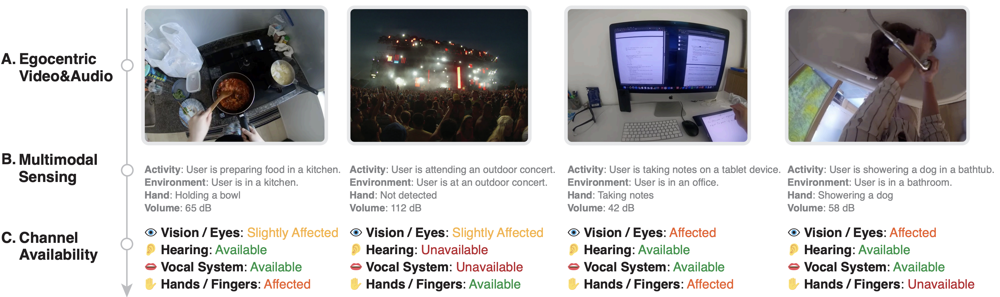

# Human I/O: A Unified Approach to Detecting Situational Impairments with Large Language Models

Copyright 2024 Google LLC

[](https://research.google/pubs/human-io-towards-comprehensive-detection-of-situational-impairments-in-everyday-activities/)

**Human I/O** is a research project that aims to propose a unified approach to
detecting a wide range of Situationally Induced Impairments and Disabilities
(SIIDs) by predicting the availability of human input/output channels. Leveraging
egocentric vision, multimodal sensing and reasoning with large language models.

Please cite Human I/O as follows if you find it useful in your projects:

```bibtex
@inproceedings{Liu2024Human,
  title = {{Human I/O: Towards a Unified Approach to Detecting Situational Impairments}},
  author = {Liu, Xingyu Bruce and Li, Jiahao Nick and Kim, David and Chen, Xiang `Anthony' and Du, Ruofei},
  booktitle = {Proceedings of the 2024 CHI Conference on Human Factors in Computing Systems},
  year = {2024},
  publisher = {ACM},
  numpages = {18},
  series = {CHI},
  doi = {10.1145/3613904.3642065},
}
```

## API Keys

To run Human I/O, you need to provide your own API keys in `server.js` and `util.js` files for the web app to work properly. Search for `YOUR API KEY`

In addition, you need to place your [Google Cloud Vision AI](https://cloud.google.com/vision) credentials (`key.pem` and `cert.pem`) in the folder.

## Getting Started

### Test and run locally on a browser

```bash
npm init
npm install express
npm start
```

### View localhost web app on mobile devices

Download and install `ngrok` on your computer.
Start `ngrok` and expose the port that your web app is running on. For example, if your web app is running on port 8000, type `ngrok http 8000` in the Terminal.
Open the browser on your Android phone and type in the URL that `ngrok` provides. For example, <https://randomstring.ngrok.io/myapp>.

## Using Human I/O

You can use Human I/O, you can either use it with your webcam. You can select the webcam device from the `cameraSelect` dropdown.

In addition, you can run Human I/O on local videos. Put your video (.mp4 format) into the video folder, enter the video filename (without .mp4), and click `load`.

## Blog Post

[Human I/O: Detecting situational impairments with large language models
](https://research.google/blog/human-io-detecting-situational-impairments-with-large-language-models/)

> **Security hardening**  
> - Do **not** put secrets in client code. Provide `OPENAI_API_KEY` and `REPLICATE_TOKEN` as environment variables on the server.  
> - If you expose the app over the Internet (e.g., ngrok), ensure it runs behind the backend proxy (`/api/chat`) and never serve server-side files from the static root.

> **Security hardening**  
> - Do **not** put secrets in client code. Provide `OPENAI_API_KEY` and `REPLICATE_TOKEN` as environment variables on the server.  
> - If you expose the app over the Internet (e.g., ngrok), keep server files non-public and call `/api/chat` proxy from the client.
