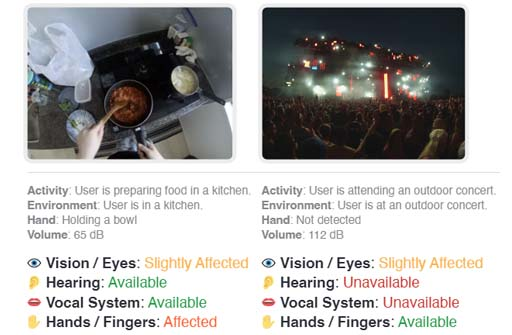

# Human I/O: Detecting Situational Impairments with Large Language Models

Copyright 2024 Google LLC

[](https://research.google/pubs/human-io-towards-comprehensive-detection-of-situational-impairments-in-everyday-activities/)

**Human I/O** is a research project that aims to propose a unified approach to
detecting a wide range of Situationally Induced Impairments and Disabilities
(SIIDs) by gauging the availability of human input/output channels. Leveraging
egocentric vision, multimodal sensing and reasoning with large language models.

Please cite Human I/O as follows if you find it useful in your projects:

```bibtex
@inproceedings{Liu2024Human,
  title = {{Human I/O: Towards a Unified Approach to Detecting Situational Impairments}},
  author = {Liu, XingyuBruce and Li, JiahaoNick and Kim, David and Chen, Xiang'Anthony' and Du, Ruofei},
  booktitle = {Proceedings of the 2024 CHI Conference on Human Factors in Computing Systems},
  year = {2024},
  publisher = {ACM},
  numpages = {18},
  series = {CHI},
  doi = {10.1145/3613904.3642065},
}
```
